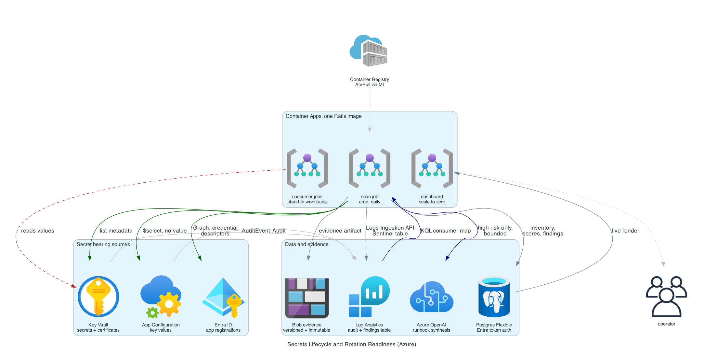

# Secrets Lifecycle and Rotation Readiness Platform (Azure)

[](https://github.com/jordann6/azure-secrets-lifecycle/actions/workflows/ci.yml)

Production-style governance tooling for Azure secrets, built as a Ruby on
Rails application. Azure Policy and Defender for Cloud can already tell
you a Key Vault secret has no expiry date. Neither can tell you why nobody
rotated it. The real reason secrets age out is that no one knows which
workloads consume them, so rotation carries outage risk. This platform
closes that gap and produces auditor-ready evidence on the way out.

This is the Azure counterpart to
[aws-secrets-lifecycle](https://github.com/jordann6/aws-secrets-lifecycle).
It is a port of the idea, not of the code: the AWS version is Go and
Python across three Lambdas, and this one is a single Rails app. Where
Azure does the job differently, the differences are called out rather than
papered over.



## What it does

1. **Scanner** sweeps Key Vault secrets and certificates, App
   Configuration key values, and Entra ID app registration credentials,
   through a bounded worker pool. It captures metadata only: object id,
   creation date, expiry, rotation policy, tags, and the vault's
   authorization model. Normalized records land in Postgres through
   ActiveRecord.
2. **Dependency analyzer** queries 90 days of Key Vault and App
   Configuration audit events in Log Analytics with KQL to build a
   consumer map per secret: which principals actually call SecretGet, how
   often, and how recently. Object ids are resolved to display names
   through Microsoft Graph, because a runbook that says "update
   8f2c1e04-..." is a puzzle, not a runbook. It combines age, consumer
   count, consumer identifiability, expiry state, rotation configuration,
   and the vault authorization model into a rotation readiness score, then
   asks Azure OpenAI to synthesize an ordered rotation runbook with a
   rollback path and a confidence level for the highest-risk resources.
   The model is pinned to `response_format: json_object`, the parse is
   validated against a required key set, and there is one retry. If the
   model is unavailable the analyzer degrades to a deterministic
   rule-based runbook, labelled `generator=fallback` so the dashboard can
   tell the two apart.
3. **Compliance evidence layer** maps every finding to HIPAA
   164.308(a)(5)(ii)(D), SOC 2 CC6.1, NIST 800-53 IA-5 and AC-2, Microsoft
   cloud security benchmark IM-3 and IM-8, and CIS Microsoft Azure
   Foundations 8.3, 8.5, and 8.7 from a versioned config file. Per-scan
   evidence artifacts go to a versioned Blob container under a time-based
   immutability policy, and findings are pushed into a custom Log
   Analytics table through the Logs Ingestion API for Microsoft Sentinel.
4. **Dashboard** is Rails, rendering live from Postgres. Scan history,
   per-scan detail, expandable risk cards with the full consumer map and
   runbook, and the raw evidence JSON at
   `/scans/:scan_id/evidence`.

A Container Apps Job on a cron schedule runs the pipeline daily. The three
stages chain through ActiveJob with the inline adapter, so one job
execution is one scan and its exit code is the pipeline's exit code.

## Rotation readiness is not risk

The single most important design decision, carried over from the AWS
version. A secret that is nine months old and read by nothing is dangerous
to keep and trivial to rotate. A secret that is thirty days old and read by
eleven principals nobody can name is the opposite. Collapsing both into one
"risk" number is what produces backlogs nobody works.

Readiness answers: how safely could this be rotated today? Higher is safer.
The Azure scoring adds two dimensions the AWS version had no equivalent
for:

- **Expiry state.** Key Vault objects carry an `exp` attribute, CIS
  requires it, and Event Grid near-expiry automation keys off it. An
  object with no expiry has no forcing function.
- **Vault authorization model.** On an access policy vault the resource
  names its readers, so a rotation plan can be built from the resource
  alone. On an RBAC vault it does not, and if the audit log is silent too
  then there is no evidence of the consumer set from either direction.
  That case is scored down explicitly.

## Security posture

The claim is that this platform never reads a secret value. Three
independent things make that true, in descending order of strength:

1. **The role cannot.** The platform's managed identity holds **Key Vault
   Reader**, which carries
   `Microsoft.KeyVault/vaults/secrets/readMetadata/action` and does not
   carry `.../secrets/getSecret/action`. Azure has no equivalent of an IAM
   explicit deny outside deny assignments, which are only creatable
   through managed applications and Blueprints, so the honest Azure answer
   is a role that never granted the permission at all.
2. **Drift is caught.** A custom Azure Policy definition audits any role
   assignment that would grant this specific principal data plane read on
   Key Vault secrets, keys, or certificates. Audit rather than deny,
   because a deny at subscription scope would also block the legitimate
   grants to the consumer identities.
3. **The code does not ask.** Every sweep uses list endpoints that return
   attributes and tags but never values, and every payload headed for the
   logs, Postgres, the evidence blob, or the model passes through a
   redaction layer first.

Two more things worth stating plainly:

- **There is no stored database credential.** Postgres has password
  authentication disabled entirely. The application authenticates with an
  Entra access token minted per connection from the same managed identity,
  hooked into the adapter's client construction so that a reconnect after
  a pool reap gets a fresh token. A platform that reports on static
  credentials should not be holding one, and "keep the password in Key
  Vault" would have meant granting the app the exact data plane read
  permission the rest of this design spends its effort avoiding.
- **App Configuration is the weak spot, and it is real.** App
  Configuration Data Reader is the narrowest built-in role and it does
  return values. There is no Key Vault Reader equivalent. The scanner uses
  `$select` to request metadata fields only and never asks for `value`, so
  the guarantee there downgrades from "the role makes it impossible" to
  "the request never asks and the redactor scrubs the response". The
  structural fix is the Key Vault reference pattern, and the seed creates
  one so the difference shows on the dashboard.

Azure OpenAI has `local_auth_enabled = false`, the storage account has
`shared_access_key_enabled = false`, and the container registry has the
admin account disabled. No API key exists anywhere in the deployment. The
one stored secret is Rails' `SECRET_KEY_BASE`, which is inert here:
sessions and cookies are disabled, the dashboard is read only, and nothing
is signed or encrypted with it.

## How the Azure design differs from the AWS one

| Concern | AWS version | Azure version | Notes |
|---|---|---|---|
| Secret stores | Secrets Manager, SSM SecureString | Key Vault secrets and certificates, App Configuration | Certificates add a real auto-renew rotation engine, which Secrets Manager rotation is the closest analogue to |
| Long-lived credential | IAM access key | Entra app registration password and certificate credentials | Federated identity credentials are swept too and scored as the good outcome |
| Access telemetry | CloudTrail to S3, Glue table with partition projection, Athena workgroup | Diagnostic settings to Log Analytics, one KQL query | The clear win for Azure: no data lake to stand up before the first row is readable |
| Inventory store | DynamoDB single-table | Postgres with ActiveRecord | Real migrations, associations, and jsonb for consumer maps and runbooks |
| Runbook synthesis | Claude on Bedrock | Azure OpenAI, managed identity, no API key | Same strict-JSON prompt, validation, retry, and rule-based fallback |
| Evidence store | S3, versioning, Object Lock governance mode | Blob, versioning, time-based immutability policy | Azure immutability is a container property, not per object |
| Findings export | Security Hub `BatchImportFindings`, ASFF | Logs Ingestion API into a custom table for Sentinel | Azure has no "import a finding" call; the DCR stream declaration is where the contract lives |
| Schedule and chaining | EventBridge, Lambda on-success destinations | Container Apps Job cron, ActiveJob inline adapter | One execution is one scan, and its exit code is the pipeline's |
| Dashboard | Reporter Lambda rendering static HTML into an S3 website bucket | Rails views rendering live from Postgres | The reporter Lambda disappears entirely; Rails can already serve a page |
| Deny on secret read | IAM explicit deny plus `kms:ViaService` deny | Key Vault Reader role, plus an Azure Policy audit for drift | Azure has no comparable explicit deny; the role is the control |

## Setup

Prerequisites: Terraform >= 1.10, Docker, the Azure CLI signed in to the
target subscription, and Owner or User Access Administrator on it (the
deployment creates role assignments). Ruby is **not** required on the
host: the same image that ships to Container Apps runs the test suite.

Azure OpenAI needs model quota in the chosen region. Without it, set
`enable_openai = false` and the pipeline still completes with rule-based
runbooks. Granting the Graph app roles needs Privileged Role
Administrator; without it, set `grant_graph_permissions = false` and the
Entra sweep is skipped while everything else runs unchanged.

```
terraform/terraform.tfvars:
  subscription_id = "..."
  operator_ip     = "203.0.113.4/32"   # your public IP, for seeding
```

```
make test        run the suite in docker
make lint        rubocop, brakeman, bundler-audit, terraform fmt and validate
make deploy      registry, image, everything else, then migrate
make seed        create the demo secret estate
make traffic     trigger the consumer jobs so the audit log fills
make scan        start a scan now instead of waiting for cron
make dashboard   print the dashboard URL
make evidence    list evidence artifacts in the immutable container
make destroy     purge evidence, remove the seed, tear down
```

`make deploy` applies twice on purpose. The container app cannot be
created until an image exists to pull, and the registry cannot exist
before Terraform runs, so the registry is targeted first, the image is
built and pushed, then the full apply proceeds.

Key Vault audit events reach Log Analytics with 5 to 15 minutes of
latency, so the demo order is `make seed`, `make traffic`, wait, then
`make scan`. Scanning immediately produces a correct scan with every
resource reported as orphaned, which is exactly what the evidence should
say when there is no access telemetry yet.

## Validation

```bash
make dashboard                        # 200, tiles populated, risk cards expand
curl -s "$(make -s dashboard)/scans/<scan_id>/evidence" | jq .metrics
make evidence                         # the artifact exists in the immutable container
az storage blob delete --account-name <acct> --container-name evidence \
  --name evidence/<scan_id>/evidence.json --auth-mode login   # expected: 409, immutable
```

In Log Analytics, confirm the consumer map source and the findings export:

```kql
AZKVAuditLogs | where OperationName == "SecretGet" | summarize count() by identity_claim_oid_g
SecOpsFindings_CL | summarize count() by Severity, FindingType
```

The dashboard states how many resources in a scan carry a simulated age
tag. Azure will not let a creation date be backdated any more than AWS
will, so seeded objects declare their age and every record built from that
tag is flagged `age_simulated` wherever it appears.

## Metrics instrumented

Per scan, shown on the dashboard and carried in the evidence artifact:

- Total resources, split into secrets and app credentials
- Mean and median age
- Percent with a fully identified consumer set
- Percent with a verified rotation path
- Percent of Key Vault objects with an expiry date set
- Expired count, orphaned count, simulated-age count
- Runbooks generated, split by model versus rule-based
- Findings by severity, by type, and by control
- Scan wall-clock time and resources per second

## Cost

| Component | Left running, per month | 3-day demo |
|---|---|---|
| Container Apps (dashboard, scans, consumers) | $0.00 (consumption free grant) | $0.00 |
| Container Registry, Basic | $5.00 | $0.50 |
| Postgres Flexible Server B1ms, 32 GB | ~$15.00 | ~$1.50 |
| Log Analytics ingestion and retention | < $0.20 (inside the 5 GB free grant) | < $0.02 |
| Blob evidence storage | < $0.05 | < $0.01 |
| Azure OpenAI, gpt-4o-mini, 5 runbooks per scan | ~$0.12 | ~$0.01 |
| App Configuration, free tier | $0.00 | $0.00 |
| Key Vault operations | < $0.05 | < $0.01 |
| **Total** | **~$20.40** | **~$2.05** |

Postgres is the only resource that does not scale to zero. Between demos:

```bash
az postgres flexible-server stop -g secops-rg -n <server>
```

which drops that line to storage only.

**Teardown risk.** The evidence container has a time-based immutability
policy, created **unlocked**. A locked policy cannot be shortened or
removed by anyone including the subscription owner, and the storage
account survives until every blob's window expires. That is correct for a
real compliance programme and wrong for a project built to deploy, demo,
and destroy in an afternoon. Locking it is a one-line change and a
deliberate decision. `make destroy` removes the policy, deletes the blobs
and their versions, then destroys.

The Key Vault has purge protection enabled, so `terraform destroy` leaves
a soft-deleted vault behind. It bills nothing and expires on its own after
the retention window. `az keyvault list-deleted` shows it.

## Repository layout

```
app/services/azure/       token chain (Container Apps, IMDS, az CLI) and REST client
app/services/scanner/     sweeps, normalization, bounded worker pool
app/services/analyzer/    KQL, consumer map, scoring, runbooks, metrics, redaction
app/services/evidence/    control mapping, blob writer, Sentinel export
app/models/               Scan, SecretRecord, Analysis, Finding
app/jobs/                 ScanJob to AnalyzeJob to PublishJob
app/views/                dashboard, scan history, risk cards
config/control-mappings.yaml   versioned control mapping
terraform/modules/        identity, observability, key-vault, app-configuration,
                          evidence, database, openai, compute
scripts/                  seed.sh, purge_evidence.sh (operator tasks, az CLI)
spec/                     105 examples
```
